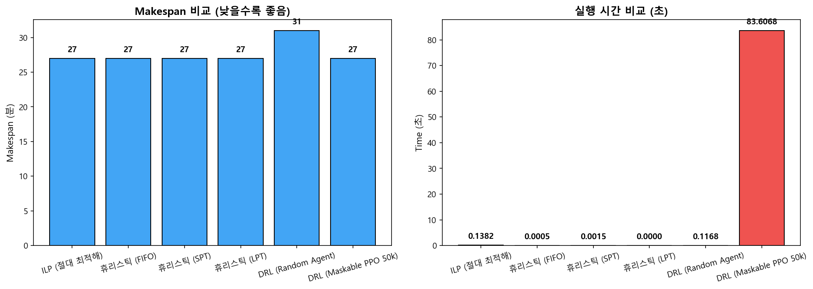
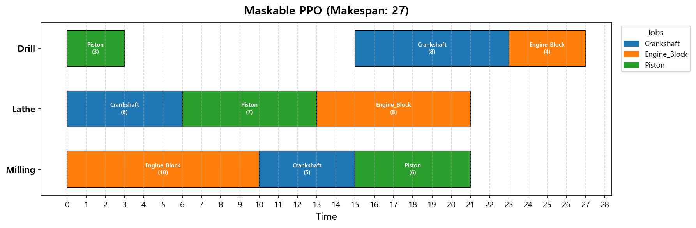
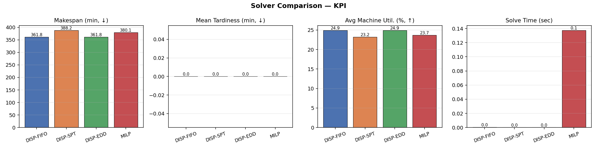
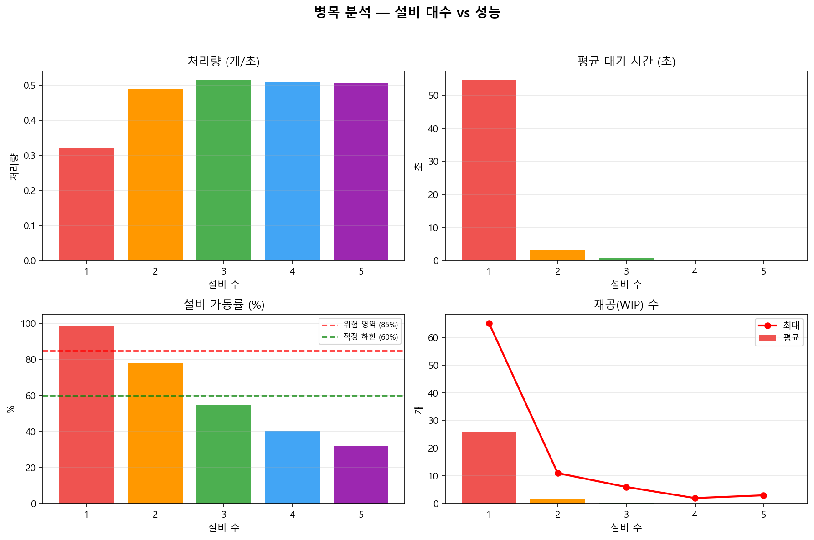

# 제조 데이터 분석과 최적화 (Manufacturing Data Analysis & Optimization)

충북대학교 대학원 1학기 「제조 데이터 분석과 최적화」 과목의 주차별 실습 코드와 결과물입니다.

> 강의자료 PDF와 원본 데이터셋(SECOM 일부, 크로메이트 공정 이미지, MVTec AD, MIMII, KAMP 등)은
> 저작권·라이선스 및 용량 문제로 저장소에 포함하지 않았습니다. 학습된 모델 체크포인트(.pth/.pt)도 제외했습니다.

## 주차별 내용

| 주차 | 주제 | 주요 내용 |
|---|---|---|
| 2주차 | 제조 AI와 자율제조 | 강의 요약 노트 |
| 3주차 | 제조 데이터 정제 | SECOM 반도체 공정 데이터 결측치·이상치 정제, 결과 보고서 |
| 4주차 | 산업 통신 프로토콜 | OPC UA 서버/클라이언트, 정보 모델링, 데이터 수집 파이프라인 |
| 5주차 | 수치 데이터 기반 AI — 예지보전 | AI4I 2020·용접 데이터 예지보전 (EDA → 전처리 → 학습 → 추론), 모델 성능 고도화 과제 |
| 6주차 | 이미지 데이터 기반 AI — 이상탐지 | 크로메이트 공정 CNN 불량 분류, MVTec AD 오토인코더 이상탐지 |
| 7주차 | 소리 데이터 기반 AI — 이상탐지 | MIMII·KAMP 설비 소리 데이터 오디오 오토인코더, 취약점 분석 보고서 |
| 8주차 | 제조 공정 최적화 | 선형계획법(PuLP, Optuna 하이퍼파라미터 탐색), 배낭 문제 동적계획법 |
| 12주차 | 생산 스케줄링 (텀프로젝트) | SimPy 공정 시뮬레이션, JSSP — ILP 최적해 vs 휴리스틱(FIFO/SPT/EDD) vs 심층강화학습(PPO) 비교 |

## 주요 결과

### JSSP 스케줄링 기법 비교 — ILP vs 휴리스틱 vs DRL (12주차)

### DRL(PPO) 간트 차트 (12주차)

### 텀프로젝트 — 디스패칭 룰 vs MILP KPI 비교 (12주차)

### SimPy 병목 분석 (12주차)

## 환경

- Python 3.x
- numpy, pandas, matplotlib, scikit-learn, PyTorch
- opcua, SimPy, PuLP, Optuna, stable-baselines3(PPO)
